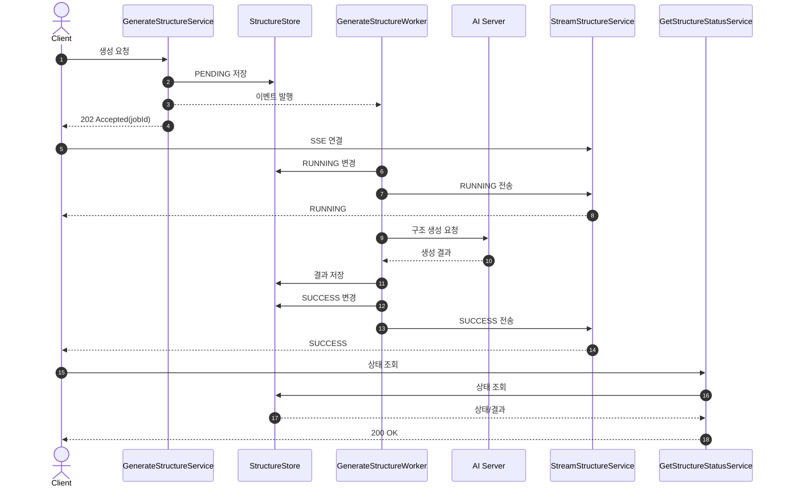

# ADR-0002-async-structure-generation-with-sse

> 작성일자
> 2026-06-09

## Status

Accepted

## Context

프로젝트 구조 생성 기능은 AI 서버와의 통신이 필요하며, 생성 시간이 수 초에서 수십 초 이상 소요될 수 있다.

동기 방식으로 처리하면 클라이언트는 생성이 끝날 때까지 HTTP 응답을 기다려야 하고, 서버는 요청 처리 자원을 오래 점유하게 된다. 또한 생성 진행 상태를 클라이언트에 실시간으로 전달하기 어렵다.

따라서 구조 생성 요청과 실제 생성 작업을 분리하고, 생성 상태와 결과를 실시간으로 전달할 수 있는 구조가 필요하다.

## Decision

프로젝트 구조 생성 기능은 비동기 이벤트 기반 구조로 구현하고, 생성 진행 상태는 SSE(Server-Sent Events)로 전달한다.

구성 요소와 책임은 다음과 같이 나눈다.

`GenerateStructureService`

- 구조 생성 요청 검증
- 초기 상태 저장
- 생성 이벤트 발행
- `202 Accepted` 응답 반환

`GenerateStructureWorker`

- 생성 이벤트 비동기 수신
- AI 서버 호출
- 생성 결과 저장
- 생성 상태 변경
- SSE 이벤트 발행

`StreamStructureService`

- `SseEmitter` 생성
- 작업 ID별 emitter 저장
- 진행, 파일 생성, 완료, 실패 이벤트 전송
- 연결 종료 시 emitter 정리

`GetStructureStatusService`

- 작업 상태 조회
- 생성 결과 조회
- 상태 응답 반환

기본 흐름은 다음과 같다.

## Consequence

장점:

- AI 서버 응답 시간을 사용자 요청 처리와 분리할 수 있다.
- 서버 요청 처리 자원을 장시간 점유하지 않는다.
- 클라이언트가 생성 진행 상황을 실시간으로 받을 수 있다.
- 생성 요청, 비동기 작업, 스트리밍, 상태 조회의 책임이 분리된다.
- 추후 Kafka, RabbitMQ 같은 메시지 큐 기반 구조로 확장하기 쉽다.

단점:

- 생성 상태 저장소 관리가 필요하다.
- SSE 연결 수에 따른 emitter 메모리 관리가 필요하다.
- 동기 방식보다 구현 복잡도가 증가한다.
- worker 실패와 SSE 연결 실패를 구분해서 처리해야 한다.

고려했으나 채택하지 않은 대안:

- 동기 처리: 구현은 단순하지만 AI 응답 시간이 길어질 경우 요청 타임아웃 위험이 있고, 진행 상태를 실시간으로 제공하기 어렵다.

구현 지침:

- 생성 요청 직후 상태는 `PENDING`으로 저장한다.
- worker가 실제 작업을 시작하면 `IN_PROGRESS`로 변경한다.
- 생성 중 파일 단위 이벤트는 `file_created`로 전송한다.
- 생성 완료 시 `complete` 이벤트를 전송하고 상태를 `COMPLETED`로 변경한다.
- 실패 시 `error` 이벤트를 전송하고 상태를 `FAILED`로 변경한다.
